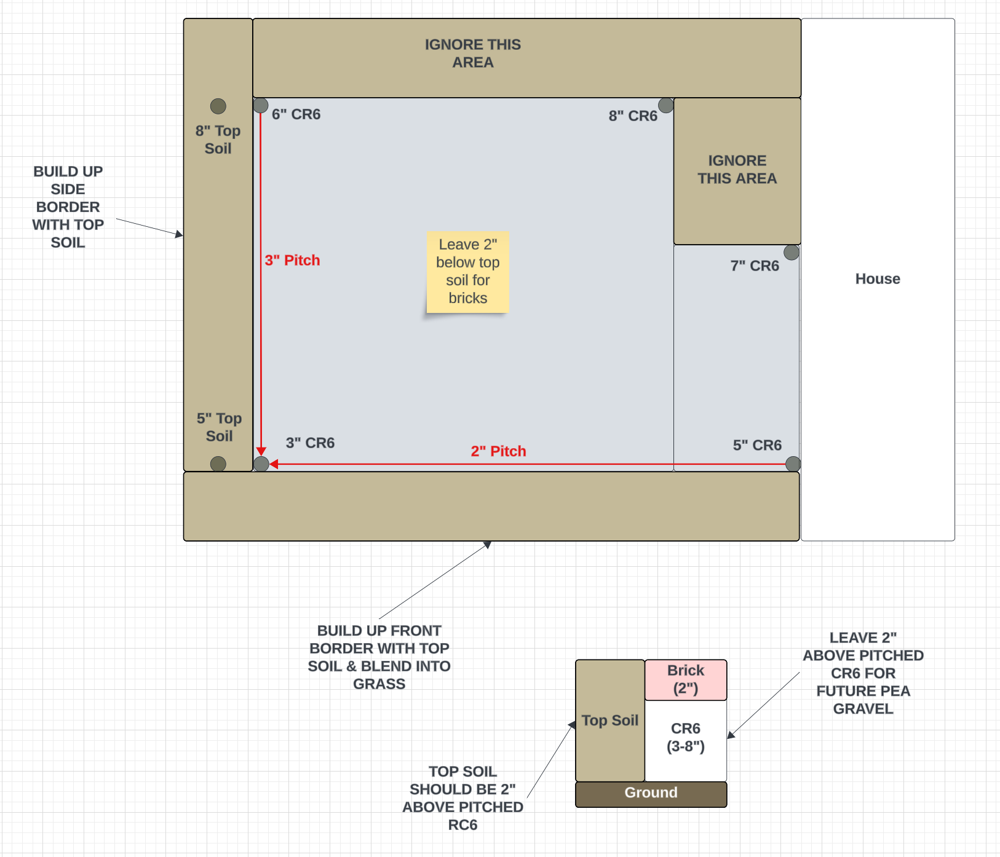

# Backyard Garden

## Before

## After

# Steps to build

## Create 2D model of the area from satellite image overlay

## Manage tasks and dependencies

## Create grading specification

## Excavate dirt to create level plane for patio with elevated border garden

## Set raised bed foundation

# Build out raised bed sides and add underground irrigation lines

## Put down weed fabric in patio area

## Create compaction stone specification

## Fill patio area with compaction stone

## Build border garden retaining wall

## Source 40 yards of garden soil

## Fill border garden with soil

## Install raised bed tops

## Fill raised beds with soil

## Install irrigation system

## Design border garden

## Source 400 plants

## Plant 400 plants
TODO

## Install string lights

## Route underground power lines

## Lay another set of weed fabric

## Lay 4000 bricks ontop of leveled sand and paver base panels

## Get honeybees

## Put in berry bushes

## Let plants grow
