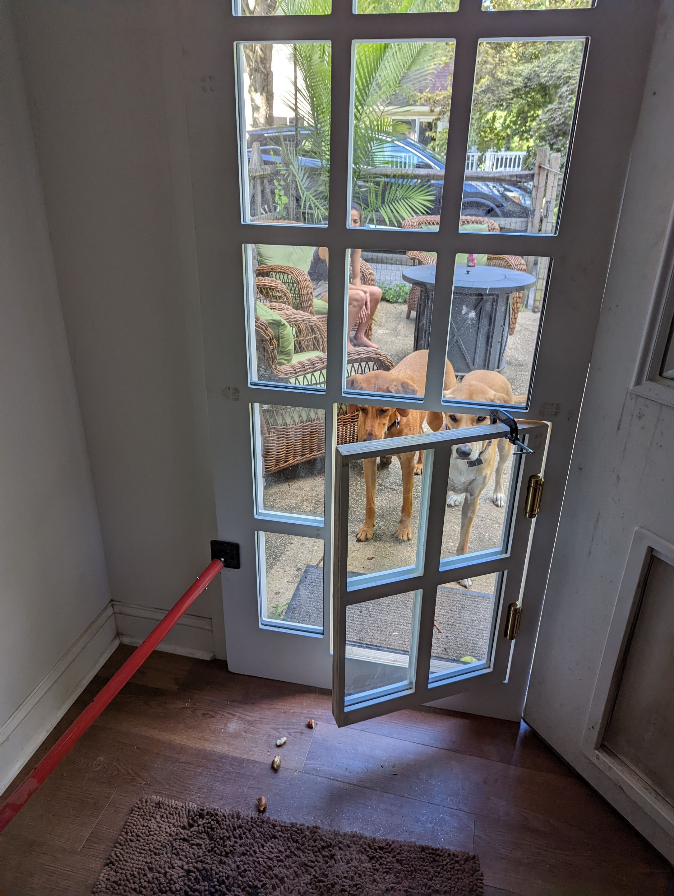
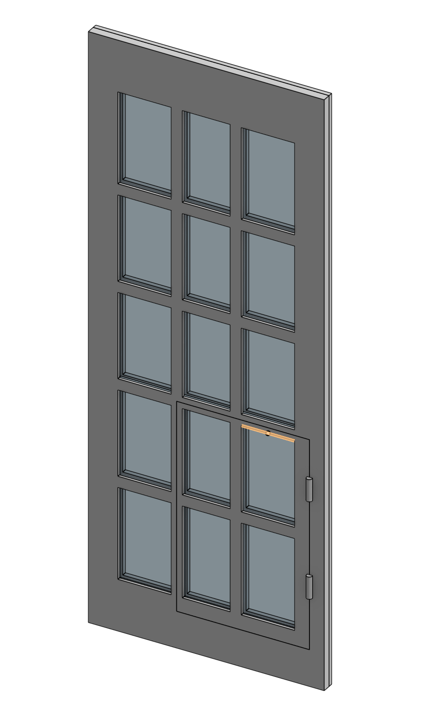
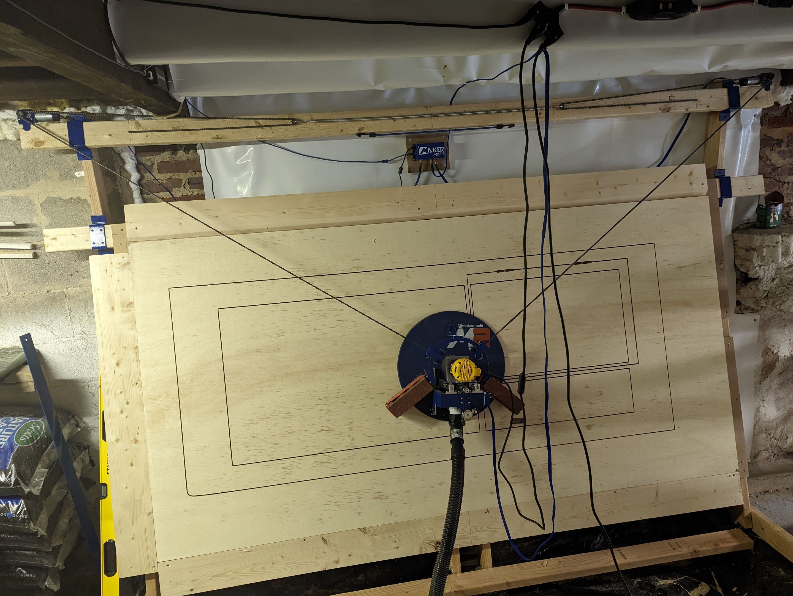
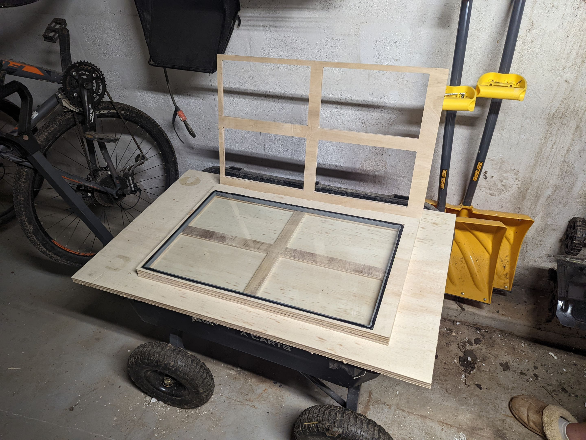
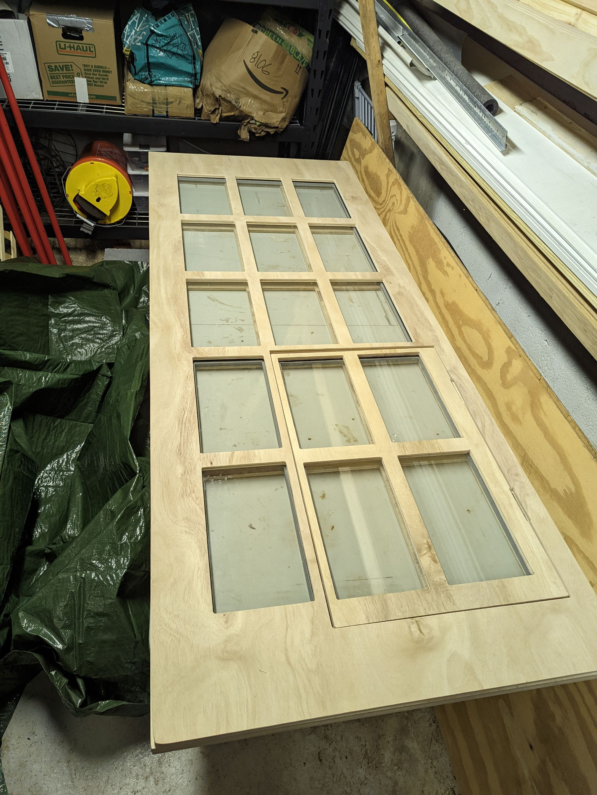
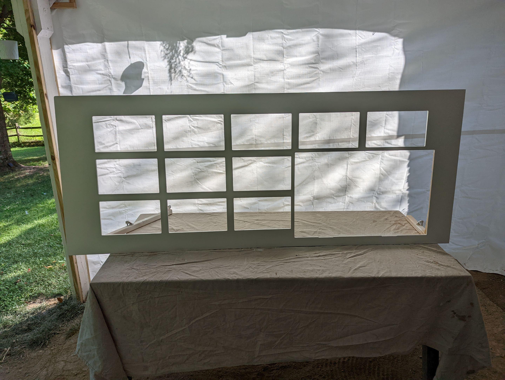
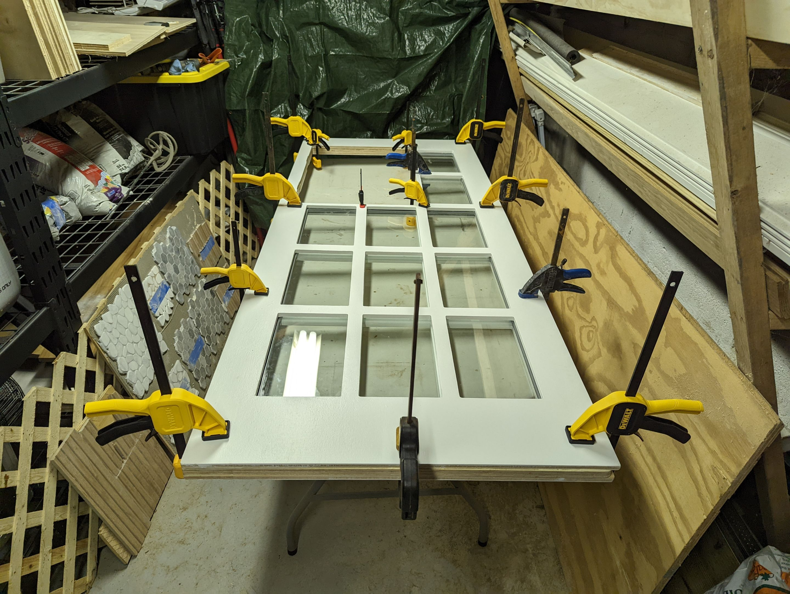
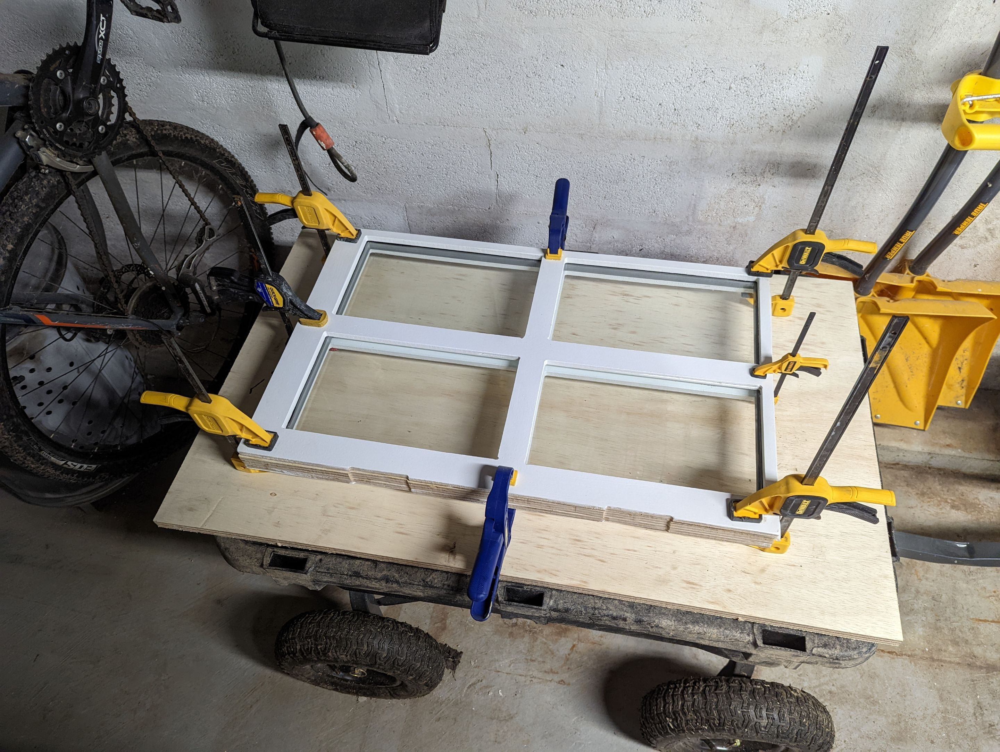
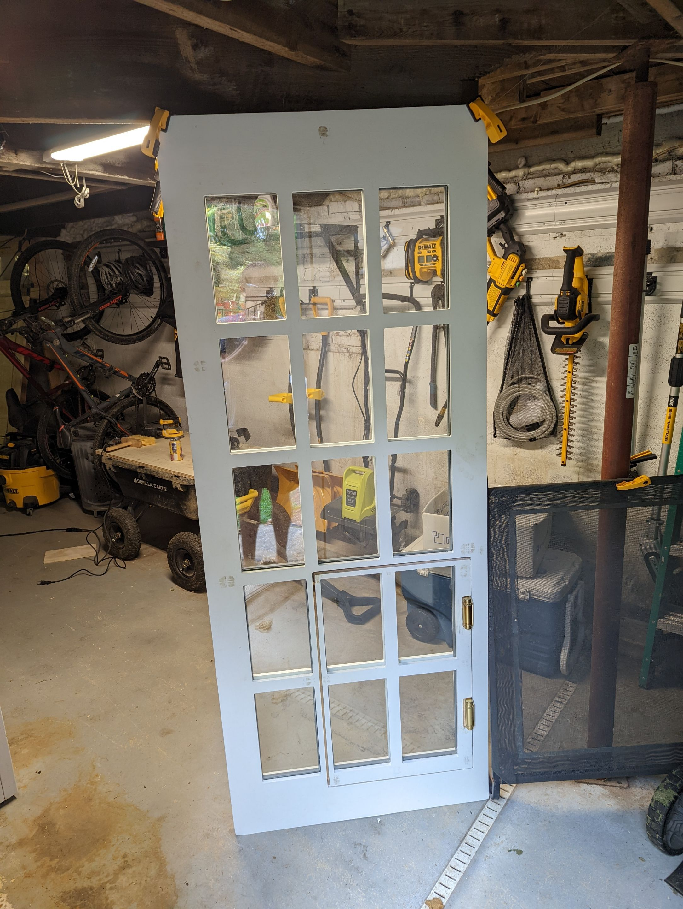

# French Dog Door

## Goals
- Make a beautiful french door with a doggy door
- Insulated glass panels for home hvac efficiency

## Results

# Steps to build

## Model door

## Build a makergrade CNC

## Export model cut paths

## Cut out on cnc

## Dry fit panels

## Paint panels

## Glue door panels w/glass inserts

## Fasten dog door with double-action hinges

## Teach dogs how to use

## Final install proof-of-concept

## Next steps
- Iterate on proof-of-concept
- Double action hinges required a good bit of force to close properly
- Concerned what would happen if it closed on a dogs leg accidentally
- Either need to figure out how to make purely mechanical solution safer
  - Considered soft flaps with more conventional dog door style opening
  - Concerned it would compromise the aesthetic and defeat the purpose 
- Or introduce electronics
  - Makes the entire solution more complex / expensive