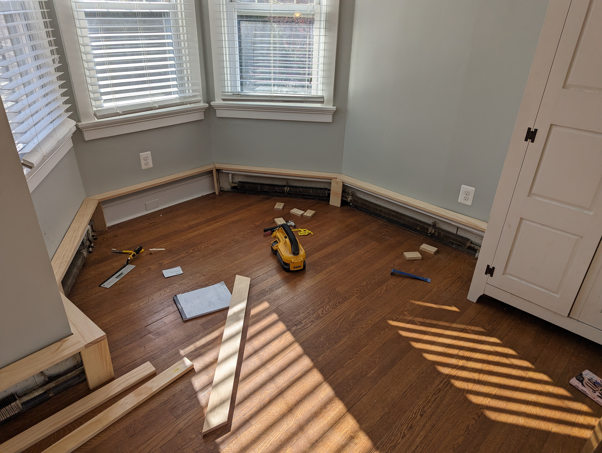
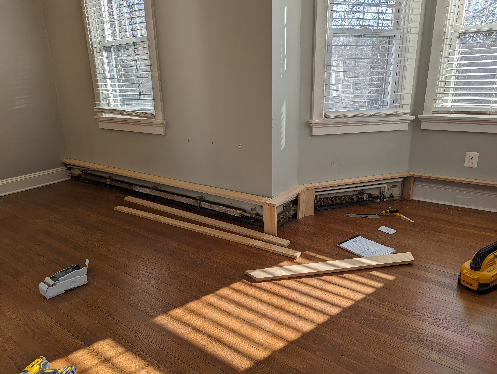
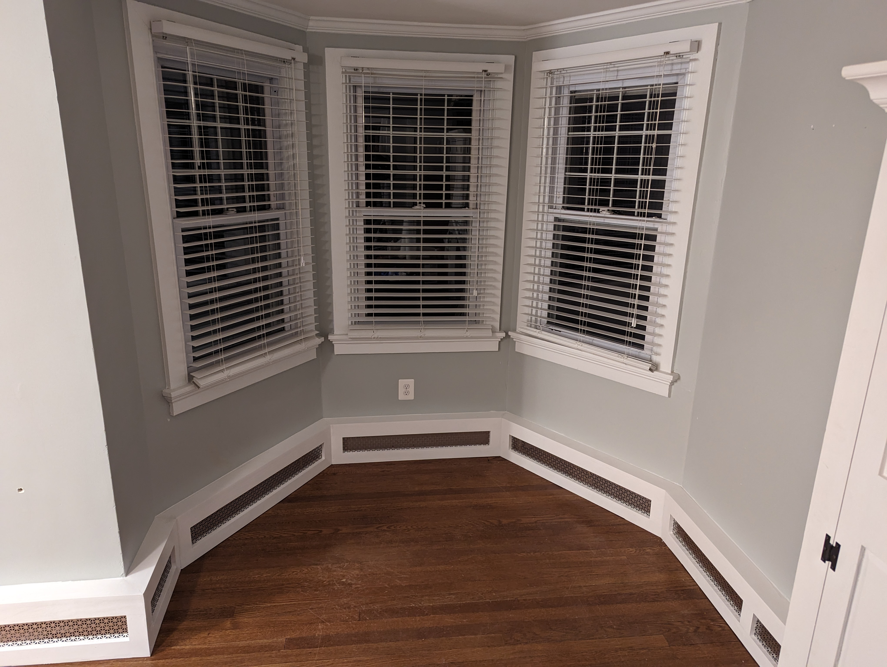
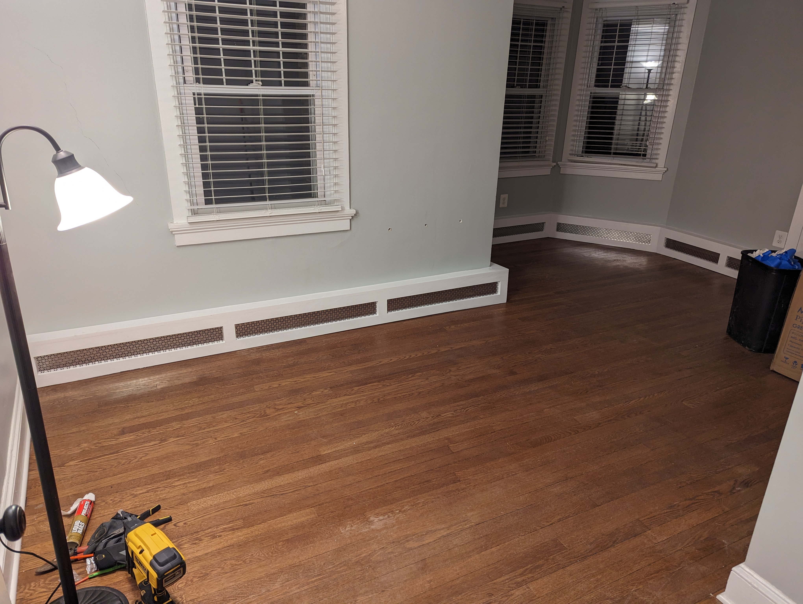
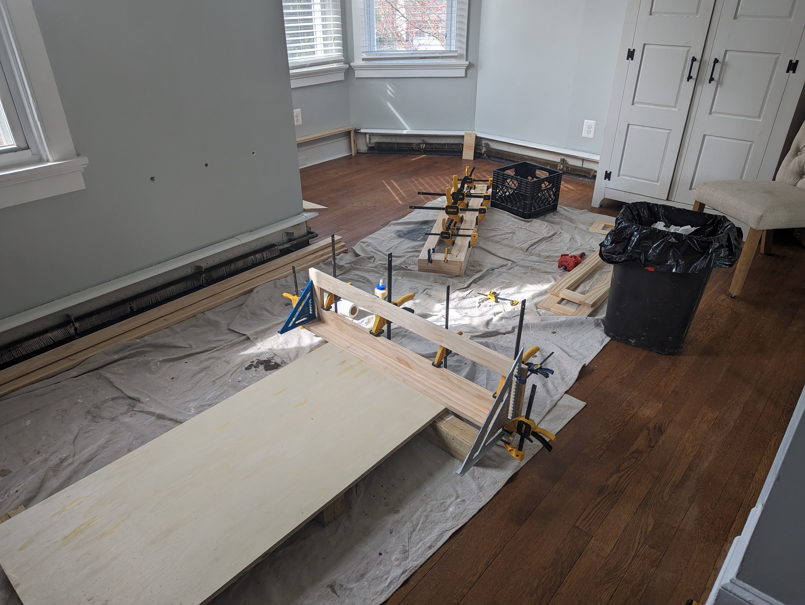
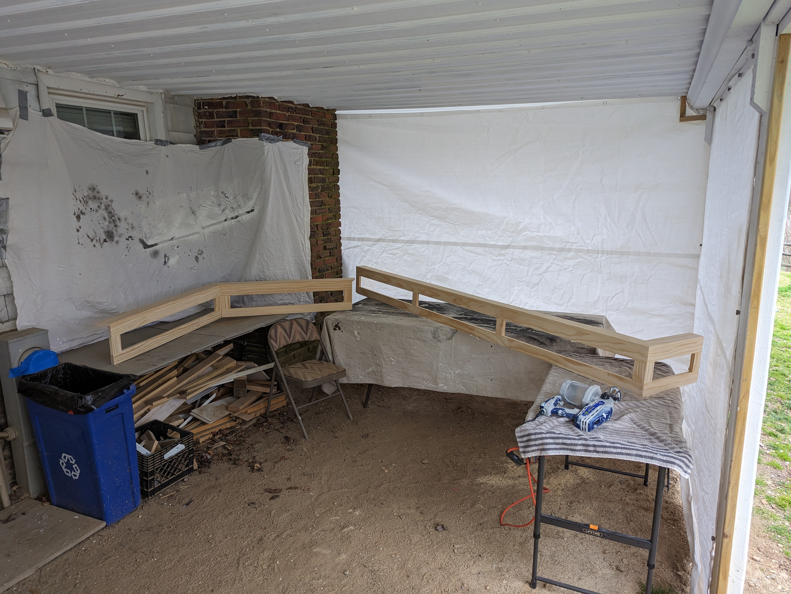
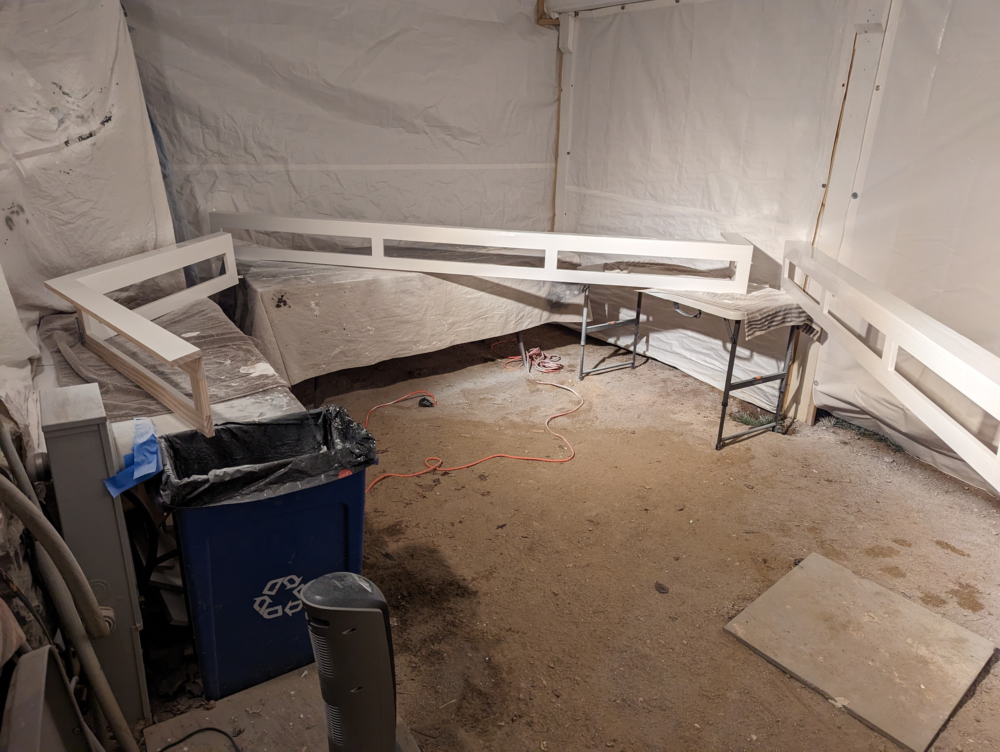

# Nursery Baseboard Heater Covers

## Goals
- Custom covers over baseboard heaters in nursery

## Before

## After

# Steps to build

## Cut and dry fit covers

## Glue covers

## Paint covers

## Add grates and install

