# Screened Porch

## Goals
- Convert open carport to screened in 3-season porch
- Still be able to store cars during winter w/garage door style front screen
- Wide opening to backyard w/barn door style doors
- Include bar seating

## Before
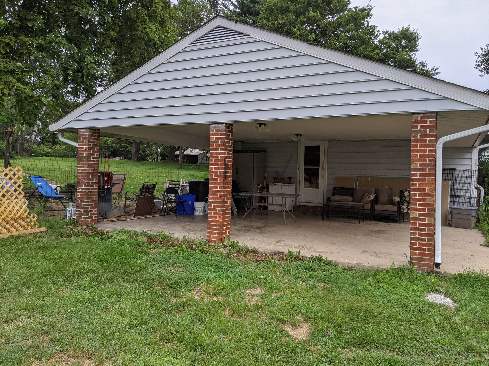

## After
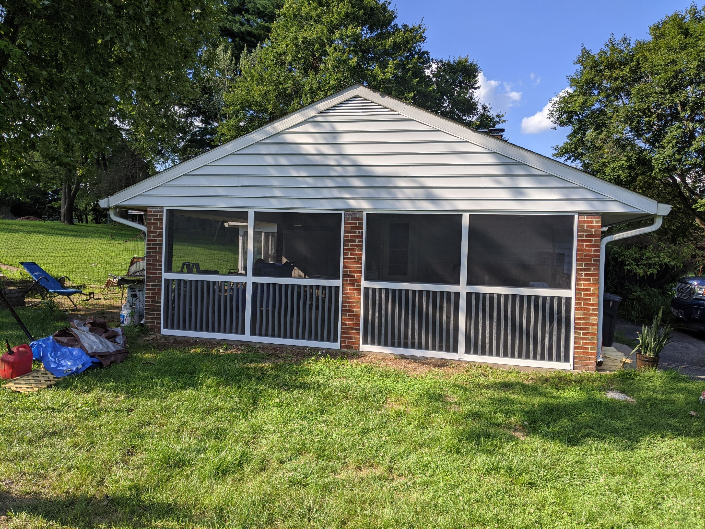

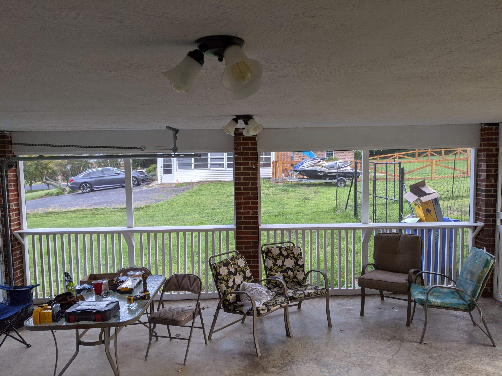

# Steps to build

## Sketch out side wall
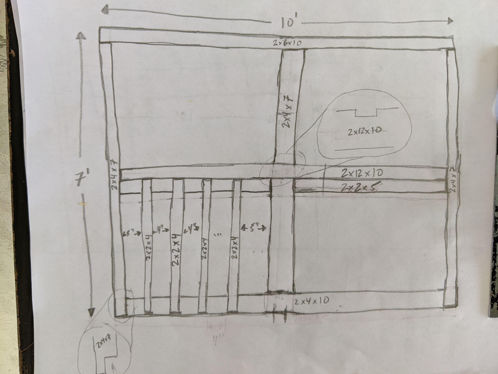

## Build side wall
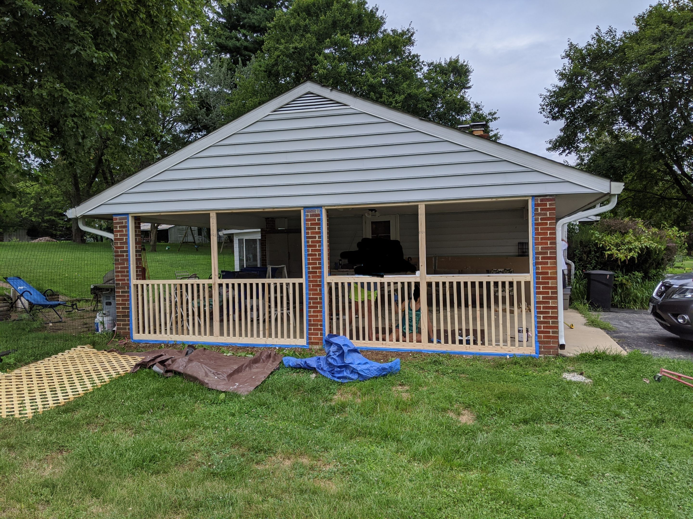

## Paint side wall
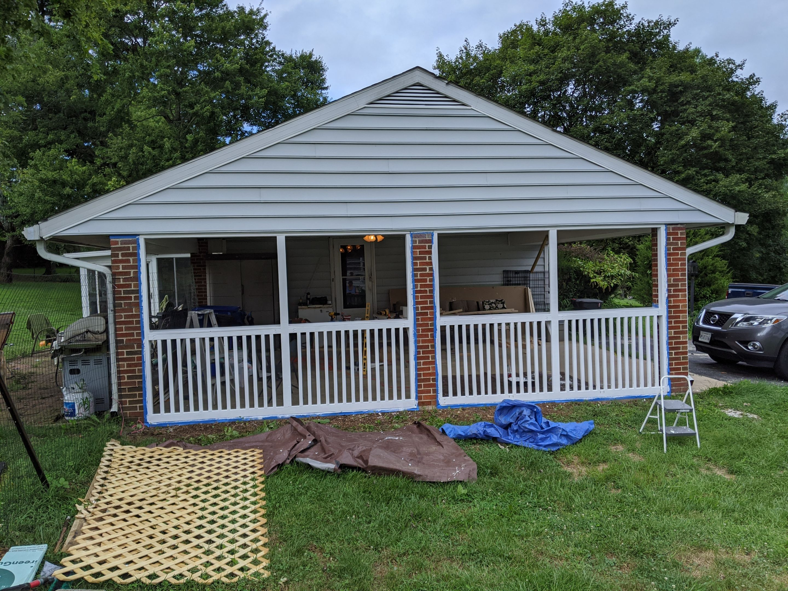

## Install side wall screen covers
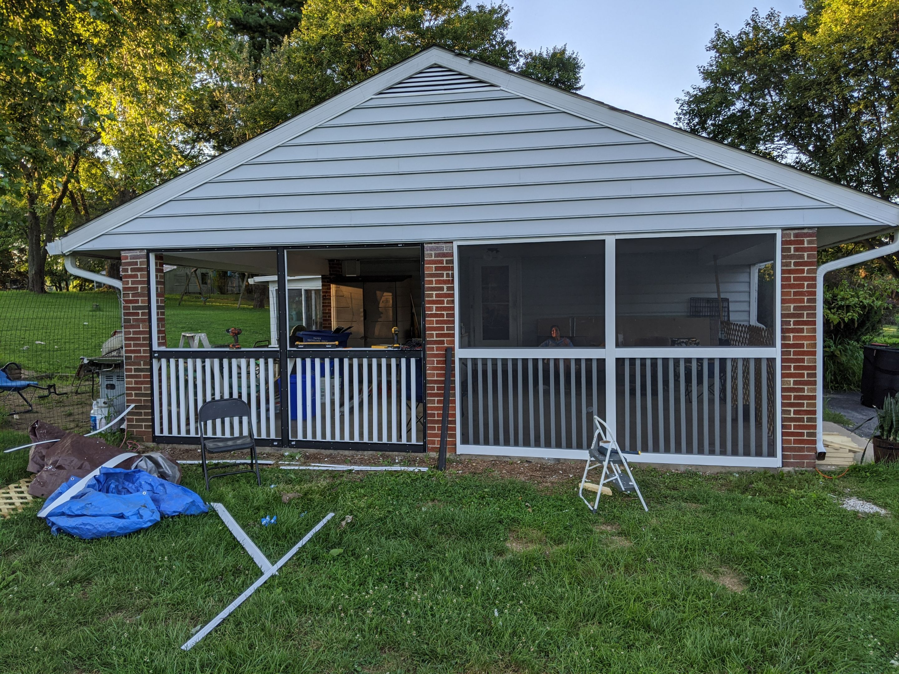

## Install front garage door screen
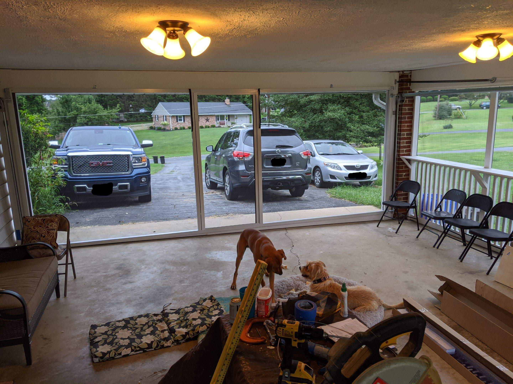

## Build back wall with barn doors
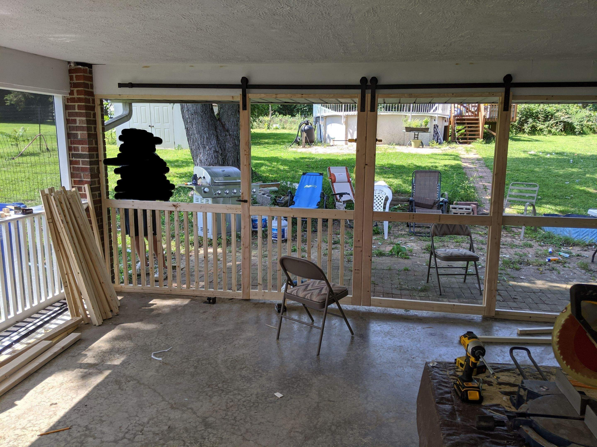

## Paint back wall and install screen covers
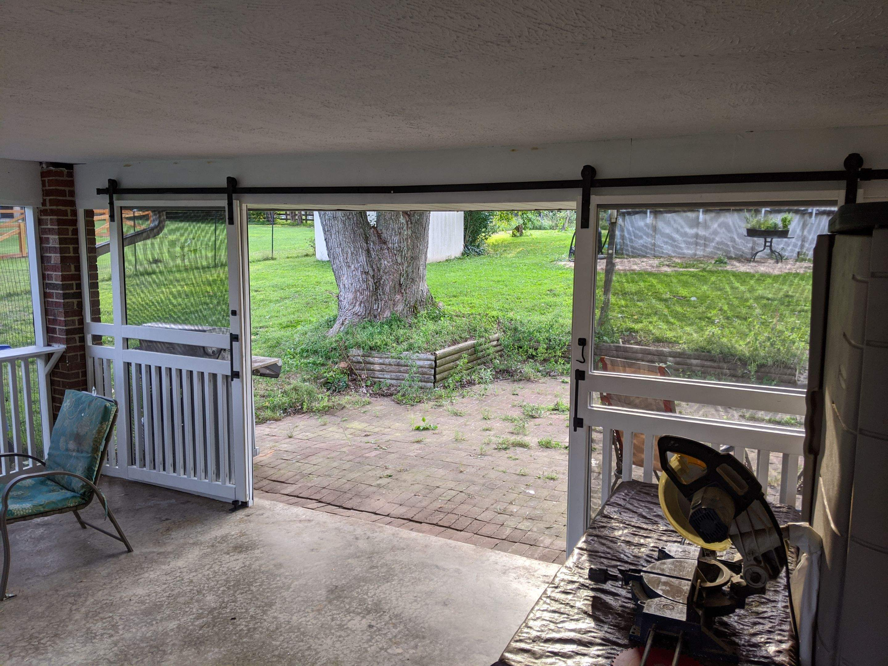
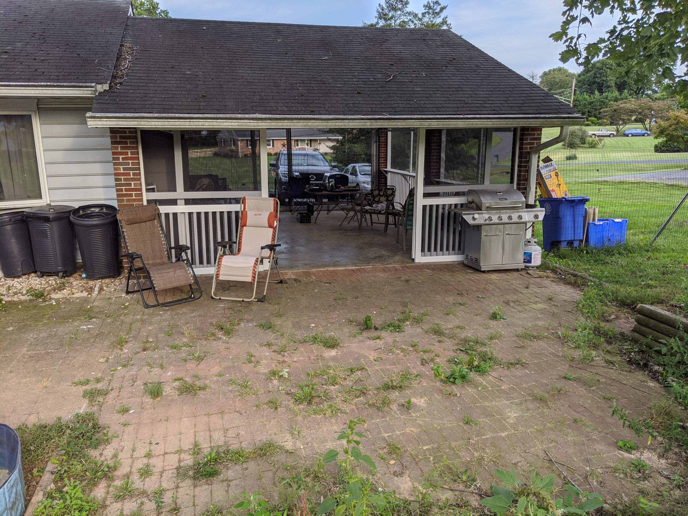