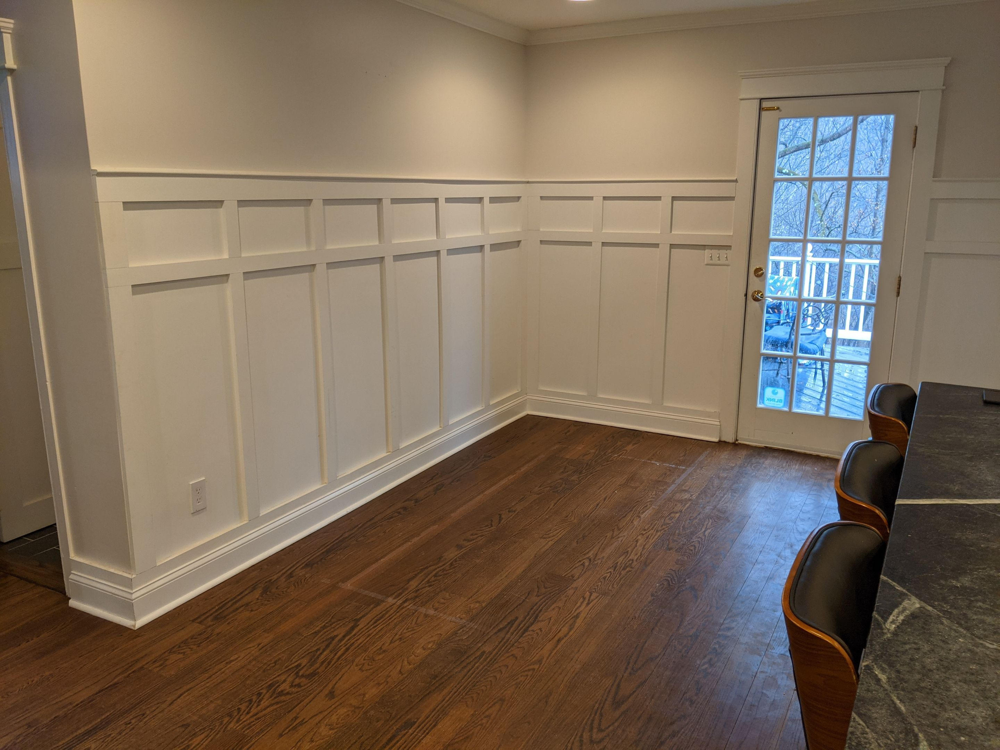
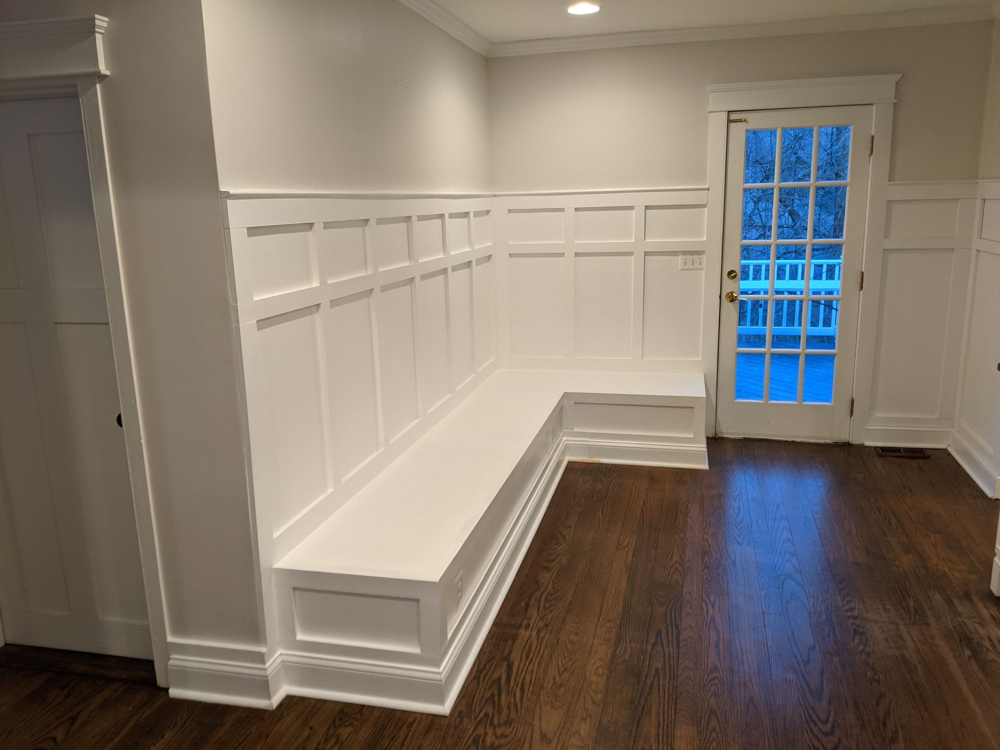
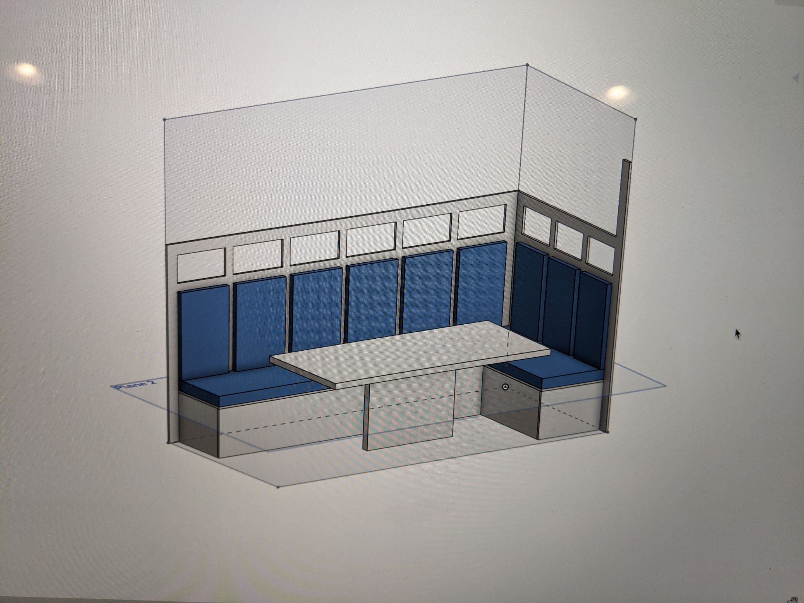
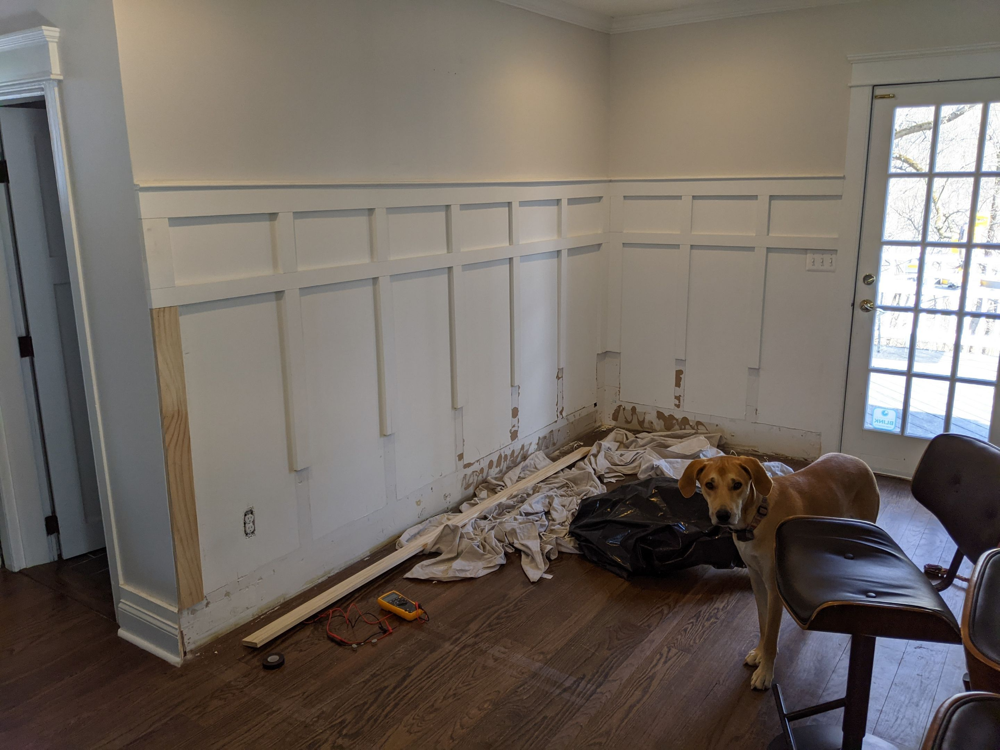
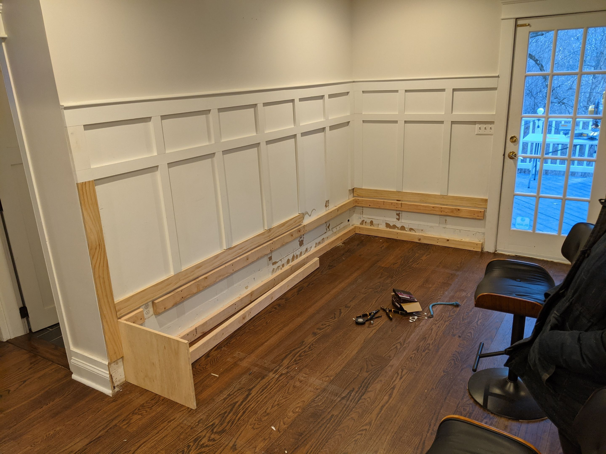
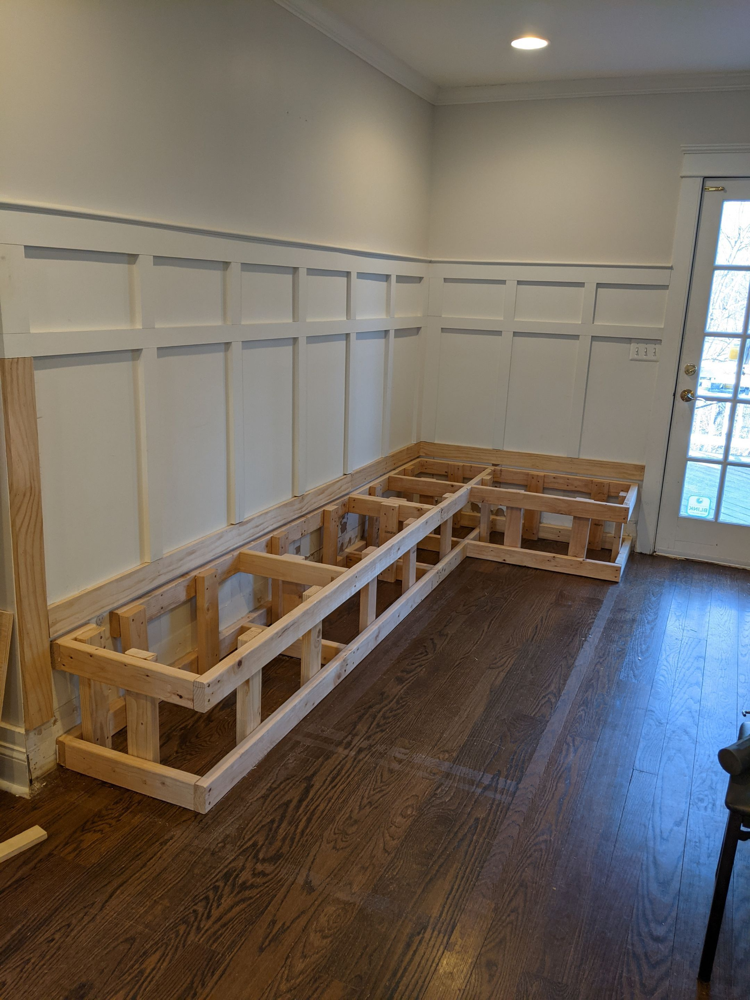
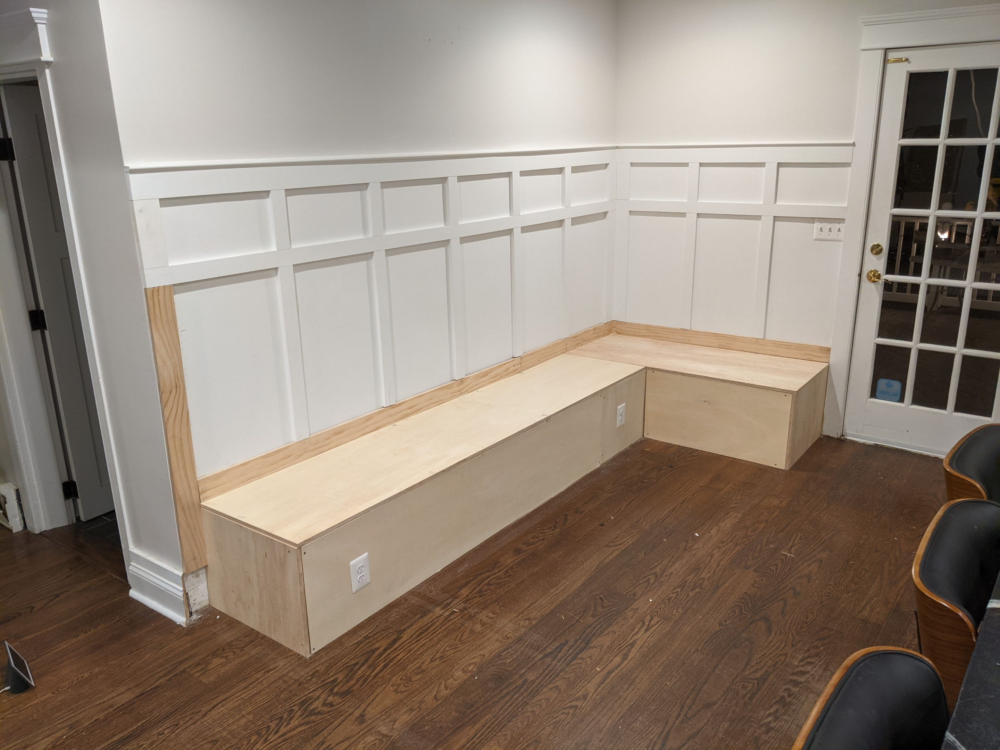
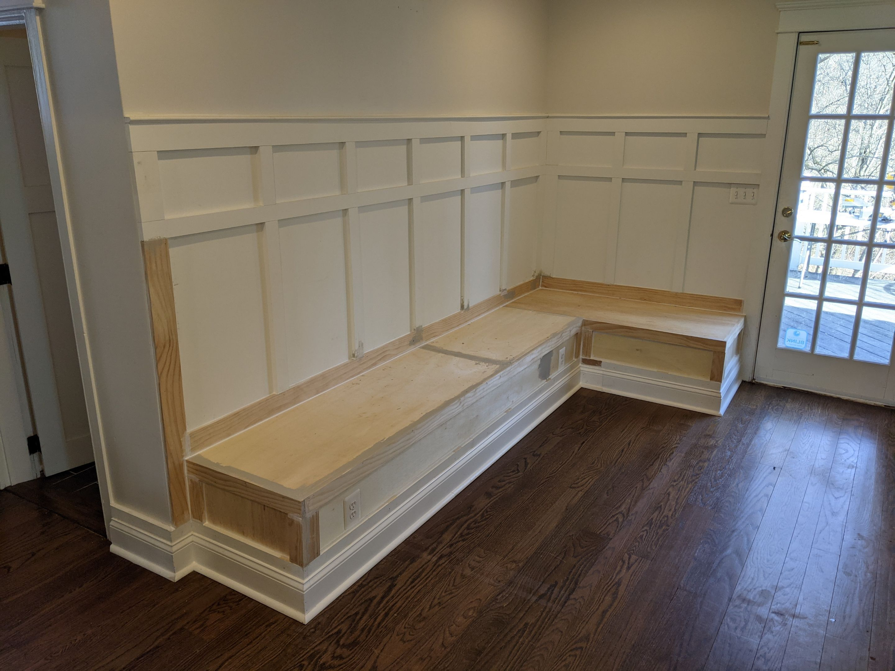

# Kitchen Nook
## Goals
- Create a kitchen nook
- Blend with existing wall wainscoting
- Include a few outlets

## Before

## After

# Steps to build
## Create 3D model in Onshape

## Remove lower wainscoting

## Install wall mounts

## Build frame

## Fasten plywood panels & install outlets

## Install border trim and fill gaps with woodfiller

## Paint
