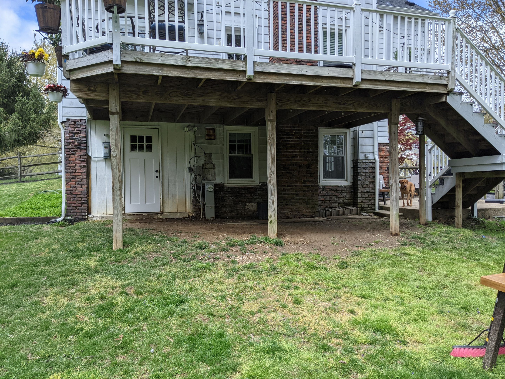
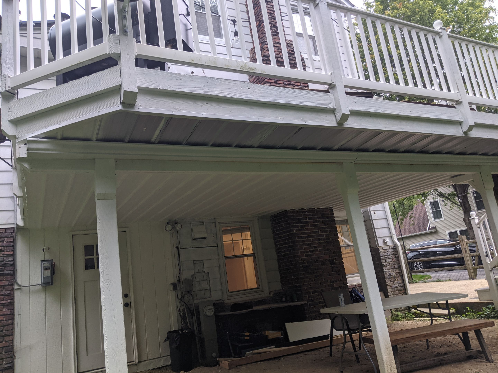
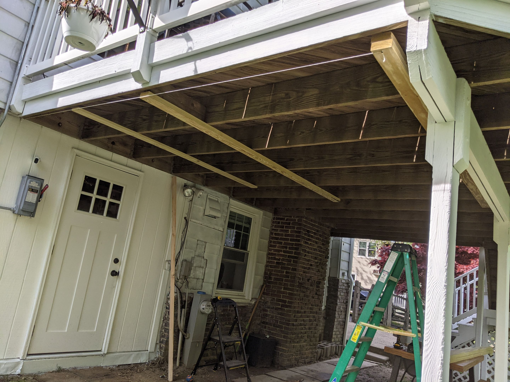
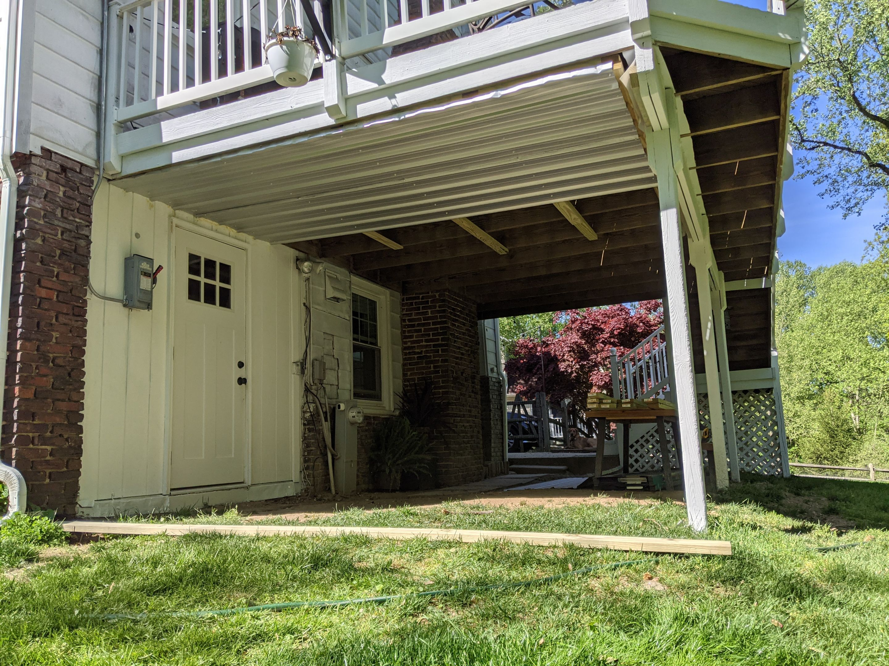
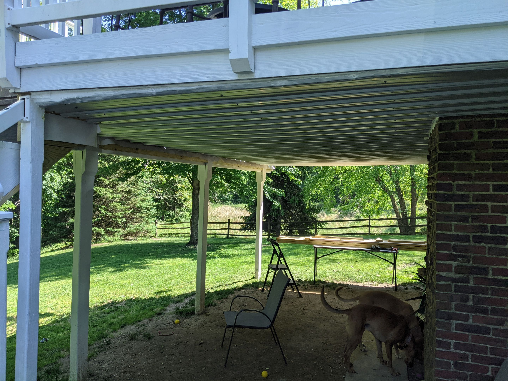
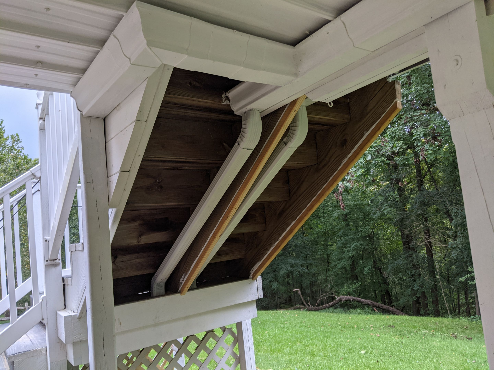

# Under Deck Ceiling

## Goals
- Create dry area below deck
- Allow for rain water collection

## Before

## After

# Steps to Build

## Install sloped crossbeams

## Fasten metal panels

## Install gutters and downspouts

## Do the same on the other side of the main support beam and paint
